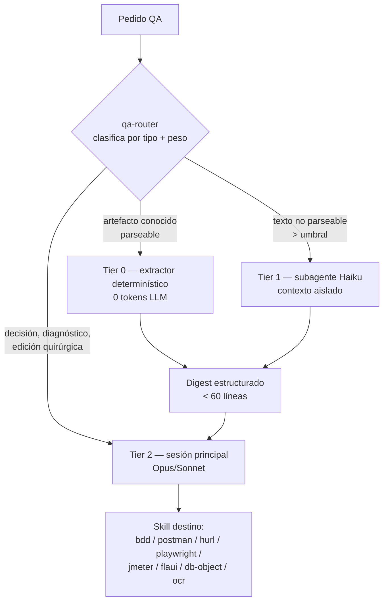

# Relevamiento — Router de consumo para QA (patrón "shunt" de Spotify Portal, sin proveedores externos)

> Estado: **propuesta de diseño**. No hay código implementado todavía — este documento releva
> la estrategia del artículo, la traduce al stack `aiquaa-labs`, y define qué skills y agentes
> construir. Fecha: 2026-09-07.

---

## 1. Qué dice el artículo (relevamiento)

**Fuente:** [Portal by Spotify cut my Claude Code token usage by 90% — Spotify Engineering](https://engineering.atspotify.com/2026/9/portal-by-spotify-cut-my-claude-code-token-usage-by-90)
(3-sep-2026). El dominio está bloqueado por el proxy de egreso de esta sesión; el contenido se
reconstruyó desde mirrors técnicos —
[gist con la arquitectura extraída](https://gist.github.com/vtri950/84b2261efbadba243870bf161764aeb7),
[Clauding](https://clauding.de/en/posts/spotify-shunt-claude-code-tokens-90-prozent/),
[DEV](https://dev.to/jamilxt/spotify-cut-claude-code-token-usage-by-90-percent-the-pattern-works-in-any-ai-agent-2i4b),
[daily.dev](https://daily.dev/posts/spotify-s-backstage-portal-cut-my-claude-code-token-usage-by-90--2beo3hwm6).
Los números citados abajo son del artículo, **no medidos por nosotros**.

### 1.1 La idea central

No es prompt engineering. Es **separación de roles por costo, forzada a nivel de arquitectura**:

- El modelo caro (Opus/Sonnet) razona: decide, diagnostica, edita con precisión, arquitectura.
- Modelos baratos ("workers") hacen el I/O: abrir archivos grandes, leer en bulk, escribir
  boilerplate repetitivo.
- El worker **nunca devuelve el archivo** — devuelve un digest estructurado. El contexto caro
  nunca ve los 4.000 tokens del archivo, ve los 40 tokens del resumen.

### 1.2 Los dos "modes" (agentes declarativos efímeros)

| Mode | Rol | Contrato de salida |
|---|---|---|
| **bulk-reader** | Lee N archivos, no edita | "Output structured bullets only. No greetings, no prose. Lead every bullet with exact name/type/line." Temp 0.2 |
| **code-writer** | Genera boilerplate desde spec + patrón de referencia | "Match existing patterns, conventions, naming, style exactly". Temp 0.2 (o 0.0). Flag `--reference` **obligatorio** para no alucinar |

Un "mode" en Portal = agente declarativo sobre runtime efímero (instrucciones + modelo +
parámetros + herramientas MCP). Conceptualmente: **una Lambda de agentes**.

### 1.3 Las 3 capas de enforcement

| Capa | Qué hace | Por qué importa |
|---|---|---|
| **L1 — PreToolUse hooks** | Bloquea duro `Read` de archivos > umbral e intercepta `cat`/`head`/`tail` sobre archivos grandes | *"Written rules are a suggestion. A block is not."* |
| **L2 — worker scripts** | Envuelven la llamada al modelo barato, delimitan archivos con XML, parsean respuesta y escriben archivos | Es el mecanismo real de ahorro |
| **L3 — instrucciones** | `SKILL.md` de `/bulk-reader` y `/code-writer`, `CLAUDE.md`, steering | Guía secundaria — sin L1 se degrada sola en sesiones largas |

La lección de diseño más importante del artículo: **el modelo no respeta una política escrita a
lo largo de una sesión larga; respeta un bloqueo.** Toda política de tokens que viva solo en un
`SKILL.md` se erosiona.

### 1.4 Umbrales, costos y límites declarados

- Umbral de delegación: **350 líneas** (configurable, `SHUNT_MIN_LINES`); subir a 500 si
  `p50 latencia > tiempo ahorrado`.
- Overhead de delegación: **10–30 s** + round-trip MCP.
- Ahorro: **~90% en bulk-read** sobre un monorepo Java.
- **Nunca se delega:** ediciones quirúrgicas (necesitan exactitud de línea), debugging,
  razonamiento, decisiones de arquitectura, archivos bajo el umbral, y cualquier caso donde la
  falta de fiabilidad del modelo barato cueste más de lo que ahorra.

---

## 2. Qué aplica a `aiquaa-labs` y qué no

La restricción del pedido es **no depender de proveedores externos**: nada de Portal, Gemini
2.5 Flash, GPT-4o-mini ni Qwen. Eso elimina la capa L2 tal como Spotify la implementó, pero
**no elimina el patrón** — el patrón es "trabajo de I/O fuera del contexto caro". Hay dos
sustitutos nativos, y el primero es mejor que el original para nuestro caso.

| Capa Spotify | Sustituto nativo en aiquaa-labs | Proveedor externo |
|---|---|---|
| Worker Gemini Flash leyendo código | **Tier 0 — extractor determinístico** (Python stdlib / `jq` / `grep`) sobre artefactos QA | Ninguno |
| Mode declarativo efímero | **Tier 1 — subagente Claude Code** (`.claude/agents/*.md`, `model: haiku`) con contexto aislado | Ninguno (mismo proveedor del CLI) |
| Claude Opus/Sonnet | **Tier 2 — sesión principal** | Ninguno |
| PreToolUse hooks | **PreToolUse hooks** — soportado nativo por Claude Code | Ninguno |

### 2.1 Por qué QA tiene una ventaja que Spotify no tenía

Spotify necesitaba un LLM barato para resumir código Java, porque el código fuente no es
parseable a un resumen útil sin comprensión. **Nuestros artefactos pesados sí son
máquina-parseables**: JSON de Newman, `.jtl` de JMeter, JUnit/NUnit XML, reporte JSON de
Playwright, colecciones Postman, `.jmx`, OpenAPI, payloads de Azure DevOps.

Consecuencia: para la mayor parte de nuestro volumen, el worker no es un modelo barato — es un
script. **Costo cero de tokens, salida determinística, reproducible y auditable** (mismo
principio que ya usa `qa-orchestrator-skill`: "reglas primero, LLM después").

El modelo barato queda solo para lo que no es parseable: leer una suite `.feature` heredada,
resumir un diff, escribir boilerplate que imite un patrón existente.

---

## 3. Diagnóstico — dónde se van los tokens en este stack

Inventario de los artefactos que hoy entran al contexto principal, por skill. Tamaños reales
del repo cuando existen; el resto son rangos típicos de proyecto real (los `examples/` del repo
son de juguete: el `.jmx` de ejemplo pesa 14,7 KB ≈ 3,7k tokens, uno real supera fácil los
100 KB).

| Artefacto | Skill | Peso típico real | Info que el modelo realmente necesita | Ratio de reducción alcanzable |
|---|---|---|---|---|
| `newman ... --reporters json` | postman-newman | 1–10 MB | requests fallidos + assert + status + counters | ~99% |
| `.jtl` / CSV de JMeter | jmeter | 10–500 MB | p50/p90/p95/p99, error%, top-N lentos por sampler | ~99,9% |
| JUnit / NUnit XML | postman-newman, flaui, hurl | 100 KB–5 MB | fallos + mensaje + counts | ~98% |
| Reporte JSON de Playwright | playwright | 500 KB–20 MB | specs fallidos + retry + error line | ~99% |
| `.jmx` | jmeter | 15–200 KB | thread groups, samplers, assertions, variables | ~95% |
| Colección Postman v2.1 | postman-newman | 50–500 KB | árbol de requests + nombres de tests | ~93% |
| OpenAPI del sandbox (32 endpoints) | sandbox, todas | 100–400 KB | tabla de endpoints del grupo N | ~95% |
| Diff de PR | qa-orchestrator, qa-productivity | 10 KB–2 MB | rutas + extensiones + hunk headers | ~90% |
| JSON de `az boards`/`repos`/`pipelines` | qa-productivity | 50 KB–5 MB | los campos de `metrics-spec.md` | ~97% |
| PDF/imagen OCR crudo | ocr-bdd | 5–50 KB por página | requisitos extraídos | ~80% |
| Suite `.feature` heredada | bdd | 20–200 KB | scenarios + tags + steps únicos | ~85% (tier 1) |

**Lectura del diagnóstico:** el gasto no está en el razonamiento QA — está en que resultados de
ejecución y specs de herramientas entran crudos al contexto. Es exactamente el problema del
artículo, con artefactos aún más pesados y mucho más estructurados.

---

## 4. Arquitectura propuesta — router de 3 tiers



### 4.1 Reglas de ruteo

| Condición | Tier | Motivo |
|---|---|---|
| Extensión/patrón en la tabla de artefactos (§3), **sin importar el tamaño** | 0 | Hay extractor exacto; leerlo crudo nunca se justifica |
| Archivo de texto > **400 líneas** sin extractor | 1 | Umbral propio (Spotify usa 350; nuestros `SKILL.md` rondan 200–300 y deben seguir siendo lectura directa) |
| Más de 3 búsquedas independientes / exploración amplia | 1 | Ya está recomendado en `token-optimization-skill`, ahora se hace exigible |
| Boilerplate desde un patrón existente (nuevo request, nuevo `.hurl`, nuevo Page Object, esqueleto de steps) | 1 | `code-writer` con `--reference` obligatorio |
| Todo lo demás | 2 | Default |

### 4.2 Qué NUNCA se rutea (boundary duro, hereda del artículo)

- Ediciones quirúrgicas con número de línea → siempre tier 2.
- Semántica de asserts, valores esperados, nombres de campos, credenciales de entorno →
  tier 2 (mismo límite que ya fija `caveman`: se comprime la prosa, nunca la sustancia técnica).
- Escaneo de secretos (Paso 0 de `qa-orchestrator`) → tier 0 determinístico, jamás tier 1.
- Diagnóstico de un fallo, decisión de ruteo ambigua, veredicto del informe consolidado → tier 2.
- Cualquier gate human-in-the-loop → tier 2, y en claro (no en caveman).

---

## 5. Enforcement — las 3 capas, en versión nativa

### L1 — PreToolUse hook (el bloqueo)

`.claude/settings.json` del repo del alumno o del proyecto:

```json
{
  "hooks": {
    "PreToolUse": [
      {
        "matcher": "Read|Bash",
        "hooks": [
          {
            "type": "command",
            "command": "$CLAUDE_PROJECT_DIR/.claude/hooks/qa-router-guard.sh"
          }
        ]
      }
    ]
  }
}
```

`.claude/hooks/qa-router-guard.sh` (bosquejo — exit 2 bloquea y manda stderr al modelo):

```bash
#!/usr/bin/env bash
# Bloquea lecturas crudas de artefactos QA pesados y redirige al extractor correcto.
set -euo pipefail
IN=$(cat)
TOOL=$(jq -r '.tool_name' <<<"$IN")
MIN_LINES="${QA_ROUTER_MIN_LINES:-400}"

case "$TOOL" in
  Read) TARGET=$(jq -r '.tool_input.file_path // empty' <<<"$IN") ;;
  Bash) CMD=$(jq -r '.tool_input.command // empty' <<<"$IN")
        # solo interesan volcados completos: cat/head -n grande/tail/jq . sobre archivo
        TARGET=$(grep -oE '(cat|head|tail|jq[^|]*) +[^ |>]+\.(json|jtl|xml|jmx|csv|har)' <<<"$CMD" \
                 | awk '{print $NF}' | head -1) ;;
  *) exit 0 ;;
esac
[ -n "${TARGET:-}" ] && [ -f "$TARGET" ] || exit 0

case "$TARGET" in
  *newman*.json|*.jtl|*.jmx|*postman_collection.json|*TestResult.xml|*junit*.xml|*.har)
    echo "BLOQUEADO por qa-router: '$TARGET' es un artefacto QA pesado." >&2
    echo "Usá el extractor: /router:digest $TARGET  (tier 0, 0 tokens)." >&2
    exit 2 ;;
esac

LINES=$(wc -l < "$TARGET")
if [ "$LINES" -gt "$MIN_LINES" ]; then
  echo "BLOQUEADO por qa-router: '$TARGET' tiene $LINES líneas (umbral $MIN_LINES)." >&2
  echo "Delegá al subagente qa-bulk-reader, o leé con offset/limit si ya sabés la línea." >&2
  exit 2
fi
exit 0
```

Escape hatch obligatorio: `QA_ROUTER_MIN_LINES=99999` o `/router:off` para una sesión — un
bloqueo sin salida se convierte en un obstáculo el día que el extractor falla.

### L2 — los workers

- **Tier 0:** `extractors/*.py` (stdlib, sin dependencias nuevas — el repo ya usa reporters
  Python con `requirements.txt`) y `extractors/*.sh`.
- **Tier 1:** subagentes en `agents/*.md` con `model: haiku`, contexto aislado: el archivo se
  carga en la ventana del subagente, y al contexto principal vuelve solo el digest.

### L3 — instrucciones

`SKILL.md` del router + una regla "digest first" agregada al `CLAUDE.md` de cada skill que
produzca artefactos pesados. Es la capa más débil — documentada como tal.

---

## 6. Qué construir — skills y agentes

### 6.1 Paquete nuevo: `qa-router-skill`

Sigue la convención del repo (`skills/<name>/SKILL.md`, `references/`, `examples/`, `docs/uso.md`,
`README.md`, `CLAUDE.md`, `.github/workflows/Y_*_CI.yml`).

```
qa-router-skill/
├── skills/qa-router/SKILL.md      ← política de tiers, comandos, boundaries
├── references/
│   ├── routing-policy.md          ← tabla completa artefacto → tier → extractor
│   ├── digest-contracts.md        ← formato de salida exacto por tipo de artefacto
│   ├── hooks-setup.md             ← settings.json + guard.sh + escape hatch
│   └── cost-ledger-schema.md      ← formato del registro de ahorro medido
├── agents/                        ← subagentes tier 1 (model: haiku)
│   ├── qa-bulk-reader.md
│   ├── qa-code-writer.md
│   ├── qa-log-triage.md
│   └── qa-diff-scout.md
├── extractors/                    ← tier 0, Python stdlib / bash
│   ├── newman_digest.py           ├── jtl_digest.py       ├── junit_digest.py
│   ├── pw_digest.py               ├── jmx_digest.py       ├── collection_digest.py
│   ├── openapi_digest.py          ├── az_digest.py        └── diff_digest.sh
├── examples/                      ← artefacto crudo + digest esperado, por tipo
└── .claude/                       ← settings.json + hooks/qa-router-guard.sh de referencia
```

**Comandos propuestos**

| Comando | Acción |
|---|---|
| `/router:instalar` | Instala hook + `settings.json` en el proyecto, con confirmación explícita |
| `/router:digest <archivo>` | Detecta tipo, corre el extractor tier 0, devuelve el digest |
| `/router:leer <glob>` | Delega a `qa-bulk-reader` (tier 1) y devuelve solo bullets |
| `/router:escribir <spec> --reference <archivo>` | Delega a `qa-code-writer`; sin `--reference` no corre |
| `/router:estado` | Tier activo, umbral, extractores disponibles, hook instalado sí/no |
| `/router:costo` | Registro de ahorro medido de la sesión (§8) |
| `/router:off` \| `/router:on` | Escape hatch |

### 6.2 Agentes (tier 1, `model: haiku`)

| Agente | Entrada | Salida (contrato) | Reemplaza a |
|---|---|---|---|
| `qa-bulk-reader` | N archivos/globs | Bullets `nombre:tipo:línea`, sin prosa, sin saludo | Leer una suite entera en el contexto principal |
| `qa-code-writer` | spec + `--reference` obligatorio | Solo el archivo generado, imitando el patrón de referencia | Generar boilerplate con el modelo caro |
| `qa-log-triage` | Digest tier 0 + cola del log crudo | Clusters de fallo (`N ocurrencias · causa · 1 ejemplo`) | Pegar logs de CI en el contexto |
| `qa-diff-scout` | Diff del PR | Una línea por archivo: ruta, extensión, hunks, keywords de señal | Cargar el diff completo para que `qa-orchestrator` lo puntúe |

`qa-diff-scout` es el de mayor palanca: alimenta directo la tabla de scoring de
`qa-orchestrator-skill` sin que el diff toque el contexto caro. El scoring sigue siendo
determinístico; solo se abarata su insumo.

### 6.3 Cambios en skills existentes

| Skill | Cambio | Impacto |
|---|---|---|
| `qa-orchestrator-skill` | Agregar columna **tier** a la decisión de ruteo: hoy decide *qué skill*, debe decidir además *quién ejecuta*. Consumir `qa-diff-scout` en el intake. Registrar el tier en la bitácora | Alto — es el punto de entrada más usado |
| `token-optimization-skill` | Hoy es advisory y sus dos mecanismos fuertes (codegraph, engram) son **MCP externos opcionales**. Reposicionar: mantiene los hábitos, y delega el enforcement al router. Sus recomendaciones propias (§"Recomendaciones propias") pasan a ser reglas exigidas por hook | Alto — resuelve la dependencia externa que el pedido quiere evitar |
| `postman-newman-skill` | `/postman:fix` y el reporter consumen `newman_digest.py` en vez del JSON crudo | Alto |
| `jmeter-skill` | Análisis de resultados siempre vía `jtl_digest.py` (streaming, nunca cargar el `.jtl`) | Muy alto — el `.jtl` es el peor ofensor del stack |
| `playwright-skill` | Triage de fallos vía `pw_digest.py` + `qa-log-triage` | Alto |
| `flaui-skill` | `sample_TestResult.xml` y sus reales vía `junit_digest.py` | Medio |
| `qa-productivity-skill` | Payloads de `az devops` vía `az_digest.py`, proyectando solo los campos de `metrics-spec.md` | Alto |
| `sandbox-skill` | OpenAPI vía `openapi_digest.py`, filtrado por grupo (ya existe `api-web-filter-convention.md`) | Medio |
| `caveman` | Sin cambios — comprime *salida*; el router recorta *entrada*. Son ortogonales y se usan juntos | — |

**Separación de responsabilidades, para que no se pisen:**
`qa-orchestrator` = *qué* probar · `qa-router` = *quién* lo ejecuta y con qué costo ·
`caveman` = *cómo se ve* la salida · `token-optimization` = hábitos del operador.

---

## 7. Contrato de digest (tier 0 y tier 1)

Regla única, heredada del `bulk-reader` de Spotify y del estilo del repo: **bullets estructurados,
sin prosa, máximo ~60 líneas, siempre con la ruta al artefacto crudo para poder profundizar.**

Ejemplo — `newman_digest.py`:

```
NEWMAN · C_PAGOS_API.json · 2026-09-07T14:02Z
TOTALES: 84 requests · 231 asserts · 7 fallos · 12.4s
FALLOS:
  POST /api/v1/payments · "status 201" · esperado 201, recibido 422 · item#12
  POST /api/v1/payments · "body.id existe" · undefined · item#12
  GET  /api/v1/payments/{id} · "p95 < 800ms" · 1240ms · item#19
  ... (4 más, mismo cluster que item#12)
CLUSTERS: 6/7 fallos derivan de item#12 (422 en creación)
CRUDO: reports/newman-2026-09-07.json (4.1 MB)
```

De 4,1 MB (≈1M tokens, imposible de cargar) a ~150 tokens, sin perder ningún dato accionable.
El contrato exacto por tipo va en `references/digest-contracts.md`.

---

## 8. Medición — no dar el 90% por sentado

El 90% del artículo es de bulk-read sobre un monorepo Java. Nuestro perfil es distinto y hay que
medirlo antes de prometerlo. Propuesta de `cost-ledger-schema.md`:

- Cada corrida de extractor registra `bytes_crudos`, `bytes_digest`, `ratio`, `tier`, `artefacto`.
- Estimación de tokens ≈ `bytes / 4` (aproximación, se declara como tal).
- `/router:costo` imprime el acumulado de la sesión: tokens evitados por tier y por skill.
- Baseline: correr `/qa:orquestar` sobre `examples/PR_DIFF_MIXTO.md` con router off vs on.

**Expectativa honesta:** en artefactos, la reducción es de 95–99% (es aritmética de parseo, no
una estimación). En una **sesión QA completa**, el ahorro realista es **40–70%**: el razonamiento,
los gates y la generación de código siguen en tier 2 y no desaparecen. Prometer 90% de sesión
sería copiar un número de otro workload.

---

## 9. Plan de implementación

| Fase | Alcance | Criterio de salida |
|---|---|---|
| **1 — Tier 0 sobre los 3 peores ofensores** | `jtl_digest.py`, `newman_digest.py`, `junit_digest.py` + `references/digest-contracts.md` | Digest verificado contra los `examples/` del repo; ratios registrados |
| **2 — Enforcement** | Hook `qa-router-guard.sh`, `settings.json`, `/router:instalar`, escape hatch | Lectura cruda de un `.jtl` queda bloqueada; `/router:off` la libera |
| **3 — Tier 1** | `qa-bulk-reader`, `qa-diff-scout` (+ integración en el intake de `qa-orchestrator`) | Un PR grande se puntúa sin que el diff entre al contexto principal |
| **4 — Resto de extractores** | `pw_digest`, `jmx_digest`, `collection_digest`, `openapi_digest`, `az_digest`, `diff_digest` | Cada skill afectada apunta a su extractor en su `CLAUDE.md` |
| **5 — Generación y medición** | `qa-code-writer` (con `--reference` obligatorio), `qa-log-triage`, `/router:costo`, CI del paquete | Baseline on/off publicado en `docs/uso.md` |

Fases 1 y 2 solas ya capturan la mayor parte del ahorro: son los artefactos más pesados y el
único mecanismo que no se erosiona en sesiones largas.

---

## 10. Riesgos y mitigaciones

| Riesgo | Mitigación |
|---|---|
| El hook bloquea algo legítimo y frena al alumno | `/router:off` + `QA_ROUTER_MIN_LINES`; el mensaje de bloqueo siempre nombra la alternativa exacta |
| Un extractor se rompe con un formato inesperado y devuelve un digest incompleto | El extractor falla ruidoso (exit ≠ 0) y cae a tier 1; nunca devuelve un digest parcial como si fuera completo |
| Digest que oculta un fallo real | Los digests **siempre** listan el 100% de los fallos (se comprime lo que pasó, nunca lo que falló) y citan la ruta al crudo |
| Tier 1 alucina al generar boilerplate | `--reference` obligatorio; sin patrón de referencia el comando no corre (regla explícita del artículo) |
| Latencia del subagente supera el ahorro | Igual que el artículo: subir el umbral (400 → 600 líneas) si `p50 latencia > tiempo ahorrado` |
| Solapamiento con `qa-orchestrator` / `token-optimization` | Separación declarada en §6.3 y repetida en los `Boundaries` de cada `SKILL.md` |
| Complejidad extra para un alumno del curso | El router es **opt-in**: sin `/router:instalar` el stack funciona igual que hoy. Se introduce recién en la semana 7–8 (JMeter/CI), donde los artefactos ya pesan |

---

## 11. Recomendación

Construir `qa-router-skill` con las fases 1–3, y hacer el enforcement opt-in por proyecto.
La adaptación clave respecto del artículo no es reemplazar el proveedor externo por otro
proveedor: es **reconocer que en QA el worker barato casi siempre puede ser un parser
determinístico**, lo que da mejor ratio que Gemini Flash, costo cero, salida reproducible y
auditabilidad — tres propiedades que un stack de testing necesita y que un modelo barato no
garantiza. El subagente Haiku queda como segundo escalón para lo que no es parseable.
