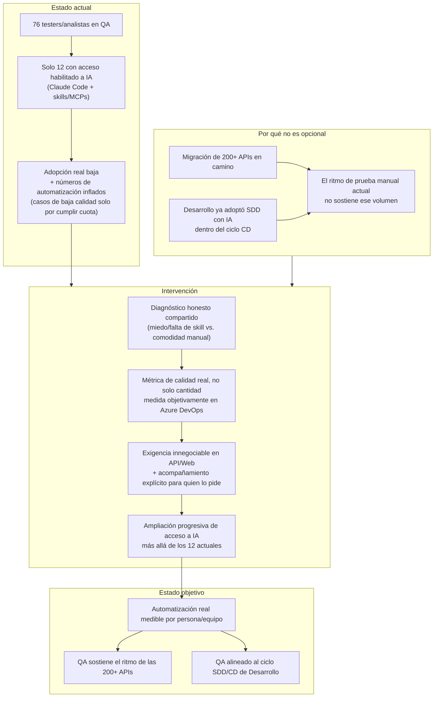

# Diagrama 1 — Flujo de adopción de IA en QA

> **Nota:** este diagrama NO incluye la arquitectura de ejecución/orquestación propia del
> equipo (portal, tareas programadas, gateway) — esa queda deliberadamente fuera de la reunión
> con líderes para no dar excusa de "esperemos a que esté listo el portal". Si se edita este
> archivo, mantener esa exclusión.

> Versión interactiva (Artifact): https://claude.ai/code/artifact/787993ed-b273-46b5-8f72-5a3c39df8365

## Diagrama

## Por qué importa para el objetivo de negocio

- **El volumen que se viene no es opcional.** La migración de 200+ APIs no es una mejora
  incremental — es un cambio de escala que el ritmo de prueba manual actual, con solo 12 de 76
  personas habilitadas en IA, no puede absorber. Este diagrama existe para que esa urgencia
  quede clara antes de cualquier exigencia o crítica puntual a una persona.
- **La medición honesta es la palanca, no el castigo.** El problema más crítico hoy no es la
  baja adopción en sí — es que parte del equipo ya habilitado infla números de automatización
  con casos de baja calidad. Pasar de "cantidad" a "calidad real medida en Azure DevOps" (ver
  `qa-productivity-skill`) es lo que convierte la conversación de una acusación en una exigencia
  objetiva y verificable, con acompañamiento explícito para quien reconozca que le falta
  conocimiento.
- **QA no puede quedar desalineado del ritmo de Desarrollo.** Desarrollo ya corre SDD con IA
  dentro del ciclo CD (ver Diagrama 2). Si QA no adopta al mismo ritmo, se convierte en el
  cuello de botella de toda la cadena de entrega — no es una decisión aislada de QA, es una
  condición para mantenerse alineado con cómo va a trabajar el resto del equipo.
