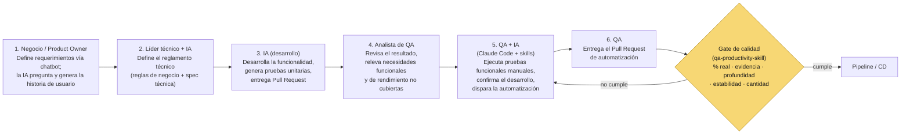

# Diagrama 2 — Flujo SDD con QA integrado

> **Nota:** este diagrama NO incluye la arquitectura de ejecución/orquestación propia del
> equipo (portal, tareas programadas, gateway) — esa queda deliberadamente fuera de la reunión
> con líderes para no dar excusa de "esperemos a que esté listo el portal". Si se edita este
> archivo, mantener esa exclusión.

> Versión interactiva (Artifact): https://claude.ai/code/artifact/787993ed-b273-46b5-8f72-5a3c39df8365

## Diagrama

## Por qué importa para el objetivo de negocio

- **QA es una etapa formal del ciclo, no un paso posterior y desconectado.** El flujo integra a
  QA desde la etapa 4 — revisando el resultado de la IA de desarrollo y relevando lo que aún no
  está cubierto, con un rol equivalente al del líder técnico pero del lado de calidad — hasta la
  etapa 6, entregando la automatización. Esto es lo que mantiene a QA dentro del mismo ritmo de
  entrega que Desarrollo, en vez de heredar trabajo acumulado al final del ciclo.
- **El gate de calidad es lo que cierra el círculo con la medición real.** El trabajo no termina
  cuando se entrega el Pull Request de automatización — termina cuando esa automatización tiene
  calidad suficiente para sostenerse en el tiempo dentro del pipeline y reducir de verdad el
  esfuerzo manual. Ese gate es exactamente lo que mide `qa-productivity-skill` sobre Azure
  DevOps: % real, evidencia de ejecución, profundidad de validación, estabilidad y cantidad —
  nunca solo cantidad.
- **Es la condición para sostener el volumen de las 200+ APIs.** Un flujo donde QA participa
  desde la definición de la historia hasta el gate de calidad es lo que hace posible absorber el
  volumen que viene sin que QA se convierta en cuello de botella — y es la referencia que todo
  el equipo puede consultar para entender su rol dentro del ciclo SDD/CD, no una decisión
  aislada de una sola persona o proyecto.
